# Snake met Scratch {first-page}
## Stap voor stap {first-page}

    

  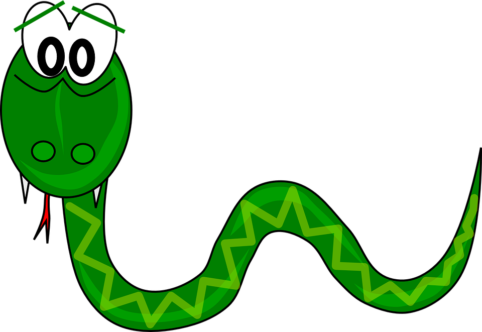

# 1. Introductie
Met deze handleiding gaan we vandaag aan de slag om  stap voor stap het klassieke spel Snake te bouwen met Scratch!

Spelregels
De spelregels van onze Snake versie zijn als volgt: Je hebt natuurlijk een slang, een speelveld en er verschijnen willekeurig appels in het speelveld. Met de pijltjestoetsen bestuur je de slang om zo 1 voor 1 de appels op te eten. Iedere keer dat de slang een appel eet, wordt de slang een stukje langer. Maar let op! De slang mag de randen van het speelveld niet raken, want dan ben je af!

Veel plezier en succes!

# 2. Aan de slag!
Om van start te kunnen moeten we eerst de volgende dingen doen:
1. Ga naar de website van Scratch http://scratch.mit.edu
2. Maak een nieuw project aan door op "maak" te klikken:
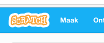

3. En geef je project een naam, bijvoorbeeld "Snake":
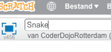

4. Standaard zet Scratch al een sprite van een kat in je project, die kunnen we weg halen door met de rechter muisknop te klikken op de kat en te klikken op "verwijderen":
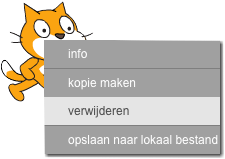

## 3. Sprites klaarzetten
Nu we ruimte hebben gemaakt door de kat weg te halen kunnen we beginnen met het neerzetten van onze eigen onderdelen. Wat hebben we eigenlijk allemaal nodig? Allereerst een appel, een slangen hoofd maar ook een slangen lichaam, want de slang groeit steeds!

De appel is makkelijk; die zit standaard al in Scratch! We moeten hem alleen nog even opzoeken.

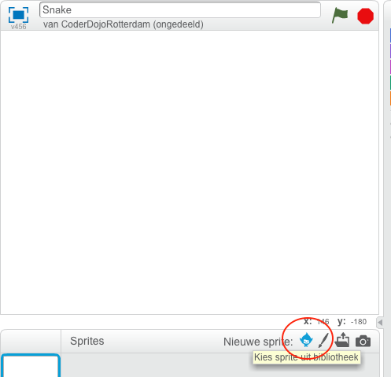

Als je de Sprite Bibliotheek hebt gevonden dan staat de appel onder de categorie "voorwerpen". Dubbelklik op de appel om hem toe te voegen aan je proejct.

Het slangenhoofd en slangenlichaam zitten niet standaard in Scratch, maar dat maakt niet uit - die kunnen we namelijk zelf tekenen! Klik op het knopje "Teken nieuwe sprite"  en druk vervolgens op de blauwe "i" om je nieuwe sprite (Sprite 1) een eigen naam te geven
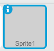
Noem deze sprite bijvoorbeeld "Slangenhoofd", zo weet je later precies over welk stukje je het hebt.

Nu we de sprite een naam hebben gegeven, kunnen we ons slangenhoofd gaan tekenen! Teken een mooi slangenhoofd met oogjes en natuurlijk niet zijn tong vergeten!

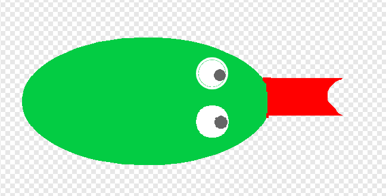

Als je klaar bent met het slangenhoofd kun je rechts onderin op "Converteer naar vectoraafbeelding" klikken. Dan wordt je tekening een echte sprite en kun je hem aanpassen in grootte. Klik nogmaals op het slangenhoofd en maak hem ongeveer even groot als de appel.

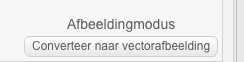

De volgende stap is de rest van het slangenlichaam te tekenen. Dit is eignlijk nog een keer doen wat je net ook deed, een nieuwe sprite maken, sprite een naam geven (slangenlichaam) en teken vervolgens gewoon een groen ingekleurde circel. Dat is voldoende voor het lichaam, we gaan hem namelijk met code uitrekken straks. Vergeet ook niet het slangenlichaam net zo groot te maken als de rest (appel en slangenhoofd) en in het midden te zetten (op het plusje).

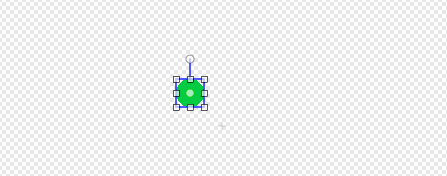

## 4. Slang bewegen
Nu we alle onderdelen hebben getekend voor onze slang, is het tijd dat de slang kan gaan bewegen. Klik bij de Sprites op het slangenhoofd en zorg dat je in het tabje Scripts bent.

Als ik op het vlaggetje klik, begin altjd in het midden, richt naar rechts en start pas met bewegen als ik op een van de pijltjestoetsen druk:

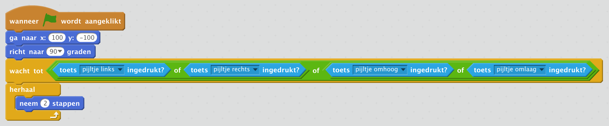

Maar als je nu op het vlaggetje drukt zie je dat de slang langzaam uit het beeld loopt en niet te besturen is, laten we dat veranderen!

Met de onderstaande blokjes vertellen we de slang dat als we op het pijltje naar boven drukken en we niet op dit moment naar beneden lopen (anders zou de slang over de kop vliegen), dan mogen we de slangenkop naar boven richten:

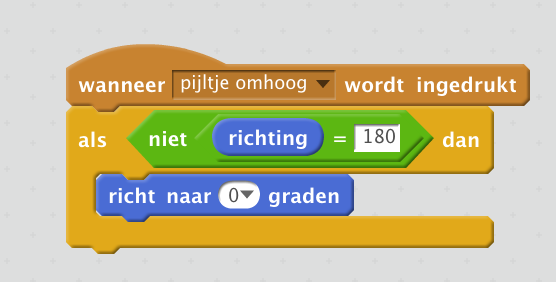

Kun je nou zelf verzinnen hoe de andere richtingen werken? Als je het goed hebt gedaan lijkt het op wat hieronder staat:

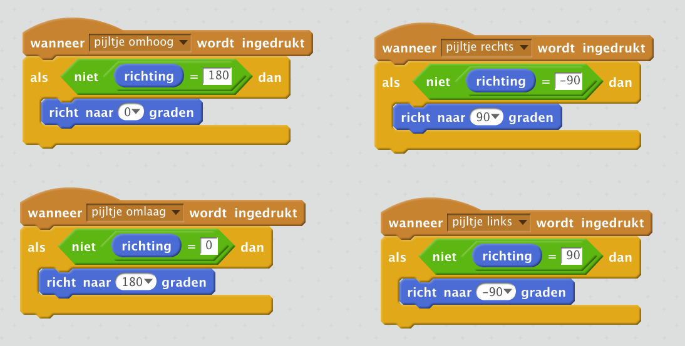

Hoe werken die richtingen eigenlijk? Bovenaan is 0 graden, naar beneden is 180. Naar rechts is dus 90 en naar links is -90 of 270 graden.

## 5. Appels!
Wat gebeurd er eigenlijk als je nu de slang een appel probeert te laten eten? Precies! Nog niks.. Dat stukje gaan we nu bouwen.

De code hiervoor is eigenlijk heel eenvoudig. Als we op het vlaggetje klikken dan moet de appel een willekeurige plaats kiezen, maar wel binnen het speelveld. Ergens tussen -240 en 240 op de X-as en tussen -180 en 180 op de Y-as is prima!

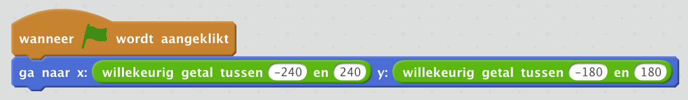

Nu zul je zien dat iedere keer dat je het spel start (op het vlaggetje klikt) de appel een andere willekeurige plaats op het scherm kiest. Maar zodra de slang de appel eet dan blijft hij gewoon staan. Om dit op te lossen moeten we nog wat in het slangenhoofd programmeren. Switch, om dit te doen, terug naar het script van het slangenhoofd en voeg hier de volgende  blokjes toe:

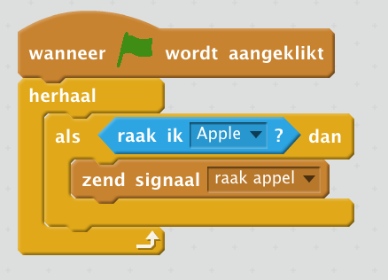

Dit stukje vertelt het slangenhoofd, als ik een appel raak, zend dan het signaal 'raak appel' uit. Dit signaal kunnen we in de appel natuurlijk weer opvangen.

In het script van de appel kunnen we dan vervolgens weer naar ditzelfde signaal luisteren en de appel een nieuwe, willekeurige positie geven:

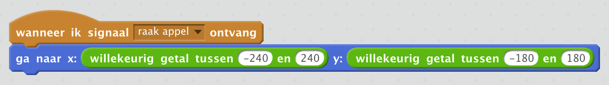

## 6. Nu de staart
Tot nu toe hebben we alleen nog maar een slangenhoofd die over het scherm loopt en appels eet. De slang wordt nog niet langer, laten we dat nu gaan bouwen! Switch nu naar het script tabje van het slangenlichaam, maak een variabele en noem die "lengte".

Tip: variabelen kun je vinden onder het kopje "Data". Als je de variabele hebt gemaakt kun je de volgende blokjes plaatsen:

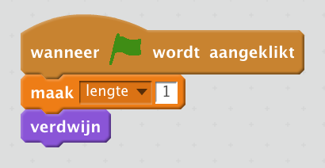

Dit vertelt het slangenlichaam dat hij zich moet verbergen en de variabele "lengte" op 1 zet zodra het spel start. Als we het spel starten willen we natuurlijk wel dat de slang een staart krijgt, dat doen we door het lichaam te clonen. Het volgende stukje vertelt het slangenlichaam dat hij zichzelf iedere 0.05 seconden moet clonen. Tip: speel maar eens met die wachttijd en zie wat er gebeurd met de slang.

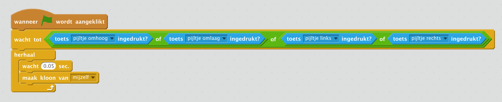

Om er voor te zorgen dat de slang niet eindeloos blijft groeien moeten we de clones natuurlijk ook weer van het scherm verwijderen. Dat doen we met het onderstaande stukje:

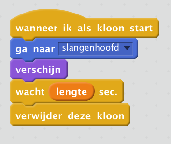

Maar als je je spelletje nu start zul je zien dat hoe veel appels je ook eet, de slang nog niet groeit. Dit komt omdat we in het slangenhoofd nog moeten vertellen dat hij de variabele "lengte" nog moet ophogen als hij de appel raakt.

Voeg in het blokje, wat checkt of het slangenhoofd de appel raakt, een blokje toe die de variabele "lengte" ophoogt met 1.

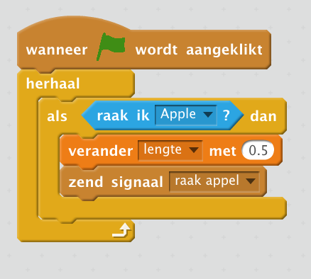

## 10. Nu jij!
Nu je een basis versie hebt van Snake is het natuurlijk tijd dat je jouw spelletje nog vetter maakt dan dat van je buurman of buurvrouw. Kun jij al deze punten erbij bouwen?

1. Zorg dat de score wordt bijgehouden!
Zorg er voor dat boven in het scherm het aantal opgegeten appels wordt weergegeven.

2. Moeilijkheid instellen deel 1
Zorg er voor dat ik met de toetsen 1 t/m 9 verschillende snelheden voor de slang kan instellen.

3. Moeilijkheid instellen deel 2
Hoe sneller de slang gaat, hoe moeilijker het is. Hoe meer punten je moet verdienen per appel, toch? Ga maar bouwen!

4. Geluiden bij eten van appels
Zorg er voor dat iedere keer dat de slang een appel eet, hij geluid maakt!

5. Steeds iets sneller na 5 appels
Kun jij de slang steeds iets sneller laten gaan na het eten van 5 appels?

6. Game over als ik de randen raak
Kun je er voor zorgen dat er een mooi game-over scherm in beeld komt zodra de slang een van de randen van het speelveld raakt?

7. Game over wanneer ik in mijn eigen staart bijt
De slang moet eigenlijk niet zijn eigen staart kunnen bijten, kun jij er voor zorgen dat ik dan game-over ben?

8. Wat kun je zelf nog verzinnen?
Wat moet jouw Snake nog meer kunnen dan die van je buurman of buurvrouw? Verzin zelf iets om jouw Snake nog cooler te maken!

Kom je er niet uit? Vraag het aan je buurman of buurvrouw of vraag het een mentor!

# Colofon

Dit document is geschreven door Tiemen Waterreus voor CoderDojo Rotterdam (SF). Mocht je na het lezen van dit document vragen of opmerkingen hebben dan zijn die utieraard welkom via contact@coderdojo-rotterdam.nl!
